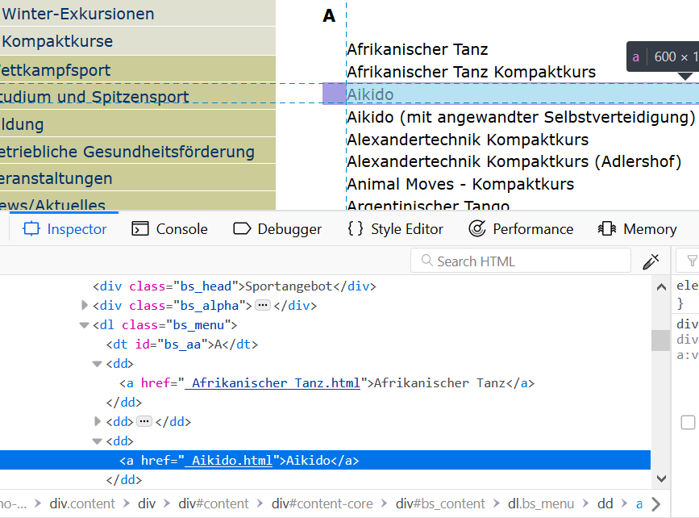
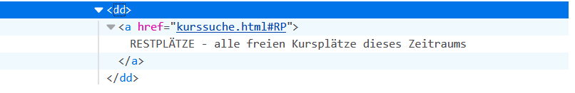

<br>
In real-world situations, jumping right into data analysis almost never happens --or at least it shouldn't happen. First, we need to get the data ready, clean it from outliers, wrong data types, and the like. But even before that, we may need to collect the data ourselves. Apart from internal databases and all kinds of surveys, websites have become an important source of data.  
 
In this tutorial, I provide a practical example to help you see web scraping in action using R. I will describe the steps you need to extract data from the website of a university's sports program. Our goal is to collect data on each course's name, level, time, period, and prices.   
 
In the [first part][1. Web scraping with the XML package], we'll cover things like HTML basics, the concept of parsing, and XPath expressions, while working on our practical example towards automating the searching and extracting process. In the [second part][2. Web scraping à la Tidyverse: rvest], you'll see how we can replicate the same process and arrive at the same results using packages from the tidyverse. 

<br>

```{r setup, warning=FALSE,message=FALSE, include=FALSE}
library(rvest)
library(XML) # Tools for Parsing and Generating XML (and HTML) 
library(RCurl)
library(knitr)
library(xtable)
library(stringr) # For string manipulation (tidyverse)
library(dplyr)

```


# 1. Web scraping with the XML package 

## 1.1 Some HTML basics


Our starting point is the webpage of the [Humboldt University Sports program](https://zeh2.zeh.hu-berlin.de/angebote/aktueller_zeitraum/). It is an index page with the list of sports courses offered for the current semester. The list is ordered alphabetically and it links to each course page with further information. We would like to collect data on level, time schedule, and prices for all sports courses.

Behind the page in your browser, there is text written in HTML, the language for web content. What makes HTML so practical is that it uses a set of tags to give hierarchical order to pieces of text and to indicate how they should be displayed. This is a distinctive feature of markup languages, just like HTML (HyperText Markup Language). Thanks to how HTML is structured, we can work with a document as a tree representation of its elements, which makes it easier to query. 


To see the HTML document itself on your browser, right-click anywhere on the index page and select *View Page Source*. Some pages might display html code in a compact form with comments and formatting removed. We would then see that many lines of code are arranged horizontally instead of vertically. This process is known as minification. And although it brings us the enjoyment of speedy websites, it can make your job as online data collector a bit harder. Fortunately, we can use an HTML beautifier to make the code readable for us. 


We can also use the element inspector. From the same index page, highlight one of the courses from the list, right-click and select *Inspect Element*. We can then navigate through the elements and track down the information we want. This is how it looks like if you're using Firefox:  

<br>  
<center>
{width=70%}
</center>
<br> 

An *element* in HTML is the combination of start tag `<tagname>`, closing tag `</tagname>`, and in-between content:`<div>I'm a section in some document</div>`. Elements have attributes, which give them meaning and context. Look at the image above, what elements contain the sports names? It's easy to see they are surrounded by `<a>` tags. These are anchor tags that associate text, for example 'Aikido', with a hyperlink to another page. The link is specified using the `href` attribute, here `href="Aikido.html"`. 
Note that the `<a>` tags are found inside `<dd>` tags, which are inside the `<dl>` tag, and so on. Elements nested inside one another is what establishes hierarchy, hence the tree structure we mentioned before. 


If you'd like to read more about HTML, I would recommend checking [w3schools' tutorials](https://www.w3schools.com/html/html_intro.asp). For an easy reference to HTML tags go to http://www.w3schools.com/tags. 


***


## 1.2 Importing HTML files into R

Let's come back to our practical example and start by getting the list of sports courses from the index page. We'll use `getURL()` from the RCurl package to access the website and bring the HTML document into R. In most cases, all we need to do is set the `url` argument to the web address. For example, the address of the index page stored in `husports_url`. In our case, we also need to add the argument `ssl.verifypeer = FALSE` to the function. This is because the website we are connecting to uses HTTPS, which is an encrypted connection. The encryption occurs under a SSL mechanism that first verifies the server's certificate and then proceeds with the connection. Unfortunately, RCurl sometimes fails to validate a certificate (even if a certificate is valid) and throws an error. If we trust the server, we can set *ssl.verifypeer* to FALSE and skip the layer of security. Although this approach works safely here, be cautious when implementing it in any other cases.

The imported html document is saved in `husports_html`. At this point, the document is just text and our object `husports_html` is of class character:

```{r}

library(RCurl)

husports_url <- "https://zeh2.zeh.hu-berlin.de/angebote/aktueller_zeitraum/"

husports_html <- getURL(husports_url, ssl.verifypeer = FALSE)

str(husports_html)
```


***

## 1.3 Parsing to interpret the tree structure


Even if we have the html code in our `husports_html` object, we still cannot make use of its html structure to further extract document parts. R needs to understand the tree structure in an object that reflects the hierarchy of the html file. This transformation from merely reading html content to interpreting it is known as parsing, and to do the job we need, well, a parser. 

Let's parse `husports_html` and store it in a new object called `husports` using `htmlParse()` from the XML package:


```{r}
library(XML)

husports <- htmlParse(file = husports_html)

str(husports)
```

Now we have a data object we can query, `husports`. In this object, html elements are represented as hierarchical nodes that R handles as lists. 

*Note on `htmlParse()`*: We are passing `husports_html` as `file` argument to the function. This is the HTML document we downloaded in the previous step. If you read the help page `?htmlParse`, you'll notice that the argument `file` can also be a URL, and you might be tempted to run the code `htmlParse(husport_url)`. Unfortunately, it will not work in our case. The reason has to do with communication protocols. Under the hood, `htmlParse(file = url)` makes the connection to the HTTP server and gets us the html file. Since HTTP pages are very common, this works in most web scraping cases. But our web page is delivered by HTTPS, a protocol *not* supported by htmlParse(). Many more protocols are supported by the RCurl package, which is why we use `getURL()` as a first step to get the html file we want. 

```{r}
# Protocols supported by the RCurl package
curlVersion()$protocols
```

***

## 1.4 Extracting information from the index page

### 1.4.1 Courses in the sports program

We'd like to know what courses are offered as part of the university's sports program. From inspecting the source code, we see that this information is located at the `<a>`nodes. To navigate through the nodes and extract their content we'll use `xpathSApply()` from the XML package. 

<br>
<center>
{width=70%}
</center>
<br>


`xpathSApply()` works on a parsed document: `husports` in our case. With the function's second argument, `path`, we'll define how to search for the node in our document, using what is called an XPath expression. 

XPath (short for XML Path) is a query language for processing and extracting parts from HTML/XML documents. The basic structure of an XPath expression looks very similar to a file location path. But instead of folders and subfolders in a directory, we have a hierarchical sequence of nodes. And just like in a file system, we can work with absolute and relative paths. With an absolute path, we need to describe the exact sequence of nodes starting at the root node, separating the elements by `/`. A relative path is less demanding: it doesn't have to start at the root node and it doesn't require the exact sequence of nodes. We can construct a relative path from any node to our target node by skipping nodes between them, indicating it with `//`.  

For example, to get to our `<a>` nodes we start with a relative path to the `<dl>` node (`"//dl"`). In comparison with an absolute path, this is eight nodes shorter in typing `"/html/body/div/div[7]/div[2]/div[2]/div/div/dl"`. From there on, giving the exact path costs no effort so we use an absolute path: `"/dd/a"`. 

Notice all the `<div>` elements involved in the (absolute) path to our target node. It's not uncommon to have many of the same elements in a webpage, but they can be distinguishable through their attributes. Thus, `<div class="navigation">` and  `<div class="content">` are both `<div>` elements defining two different sections in the document via the *class* attribute. The reason why we care about this is that we can write an XPath expression of the form `//div[@class='content']` to condition our selection based on *class* attribute. The conditioning statement inside square brackets is called the *predicate*. 

In our case, `//dl[@class='bs_menu']` means "find the `<dl>` node that has an attribute *class* with value *bs_menu*". 
 

```{r}
# Relative path
xpathSApply(husports, path = "//dl[@class='bs_menu']/dd/a")[3]
```

```{r}
# Absolute path
xpathSApply(husports, path = "/html/body/div/div[7]/div[2]/div[2]/div/div/dl/dd/a")[3]
```

`xpathSApply()` returns the complete node set that matches the XPath expression. By indexing with `[3]` we are accessing the third node in the set as an example.

At this point, our goal is to extract *only* the names of the courses. Luckily, there's a handy third argument in `xpathSApply()` that we can use to extract any node element: value, attribute, or attribute value. We simply pick any of the extractor functions available from the XML package. Here, setting `fun = xmlValue` will extract the text from our target nodes.

Let's finally get to it and create a character vector,`sports_program`, that holds all the sports listed on the index page:


```{r}
sports_program <- xpathSApply(
  husports, 
  "//dl[@class='bs_menu']/dd/a", 
  fun = xmlValue
) 

sports_program[1:5]

```

If you prefer an organized column, you can view `sports_program` as a data frame:  

```{r}
head(as.data.frame(sports_program))
```

```{r}
length(sports_program)
```

Our scraping strategy may not always be as efficient and error-free as we would like it to be. So let's do some quick check here. We may think we collected `r length(sports_program)` sports from the webpage, but take a look at the last element in `sports_program`:
  

```{r}
tail(sports_program, n = 1L)
```

This last element is not a sport but just a link to the remaining unbooked courses. It gets picked up because it belongs to the `<a>` nodes
we searched for with the XPath query `"//dl[@class='bs_menu']/dd/a"`. Given the structure of the webpage, there's no way to distinguish the last node from the rest --at least not via some attribute. What we can do is use XPath functions in the predicate to set the condition: "Bring all `<dd>` nodes except the last one". 

<br>
<center>
{width=70%}
</center>
<br>

The XPath function `last()` returns the total number of items in the processed node set. This helps if we don't know in advance how many nodes are included in the set. For example, we would use `/dd[227]` if we knew the last index position, but `/dd[last()]` if we didn't. 

Let's see how this predicate brings the `<dd>` node that appears on last position:

```{r}
xpathSApply(husports, "//dl[@class='bs_menu']/dd[last()]/a", fun = xmlValue) 
```

For the condition we intend to form, we'll need another XPath function, `position()`, which gives the index position of the node. Now we can add a predicate that reads: Select elements in the `<dd>` node set whose `position()` is not equal to the `last()` position. 


Here's the solution that allows us to extract all the sports listed on the index page *excluding the last* that is not a sport:

```{r}
sports_program <- xpathSApply(
  husports, 
  "//dl[@class='bs_menu']/dd[position()!=last()]/a", 
  xmlValue
) 

```

We should have now collected `r length(sports_program)` sports names, and the last element should be "Zumba":

```{r}
length(sports_program)

tail(sports_program, n = 1L)
```


***

### 1.4.2 Collecting links to all courses

We have extracted the names of the courses from our parsed document `husports`. From the same document, we can also gather the links to each of these courses. We will need the links later on to access the pages, import the HTML files, and extract information about each course.

The root purpose of `<a>` elements is to define links from one page to another. With this in mind, we can easily extract the `href` attribute from the selected nodes using `xmlGetAttr`:

```{r}
hrefs <- xpathSApply(
  husports,
  "//dl[@class='bs_menu']/dd[position()!=last()]/a", 
  xmlGetAttr, "href"
)

head(as.data.frame(hrefs))
```

Let's check if we have the same number of elements in `hrefs` as we have in `sports_program`, and if the last link refers to "Zumba":

```{r}
length(hrefs) == length(sports_program) 
tail(hrefs, n = 1L)
```

You probably noticed that our "links" dont't quite look like true links. Typing "_Aikido.html" in a browser won't get us anywhere. But they are the last (variable) part of each page's full URL. This means we can follow a pattern to form the links. We'll take care of that in the next section.  


***

## 1.5 Extracting data on sport courses

### 1.5.1 Importing and parsing several pages 

Our goal here is to write a function that automates the tasks of downloading and parsing HTML files from various pages. **We create a function**, `getCoursesHtml`, that will do the following: 

**1.** **Constructing URLs** for every course page. If you take a look at the webpage, you'll see that the URL of each course page is formed by attaching the names we stored in `hrefs` to our base URL `husports_url`. We can use `str_c()` from the stringr package to join the two character vectors into one:

```{r}
str_c(husports_url,hrefs[3])
```

**2.** **Importing the HTML documents** of all courses into R. We achieve this by applying the function `getURL()` to the list of URLs from the previous step.

**3.** **Parsing** the HTML documents and **saving** them in a list to be returned by the function. 
 

```{r}
getCoursesHtml <- function(pagename, baseurl) {
    require(stringr)
    require(RCurl)
    urls <- str_c(baseurl,pagename) # constructing direct links
    htmldocs <- getURL(urls, ssl.verifypeer = FALSE)  # importing html files
    courses_parsed <- lapply(htmldocs,htmlParse) # parsing
}
```

The arguments to the function are the vector of page names we collected in `hrefs`, and the URL of our index page in `husports_url`.

Applying the function will get us a list of `r length(hrefs)` **parsed html** documents:

```{r}
husports_htmls <- getCoursesHtml(hrefs, husports_url)

```
   
```{r}
typeof(husports_htmls)
length(husports_htmls)
```
Elements in our list are data objects we can query with `xpathSApply()`, just like we did with `husports`. For example, let's check the third element. This should refer to the Aikido course:
   
```{r}
str(husports_htmls[3])
```
   
To make a simple query, we can extract the name of the course, which appears as header at the course's page. If you inspect the page, [Aikido.html](https://zeh2.zeh.hu-berlin.de/angebote/aktueller_zeitraum/_Aikido.html), you'll identify what node we need to select:

```{r}
xpathSApply(
  husports_htmls[[3]], 
  "//div[@class='bs_head']",
  xmlValue
)
```

For a finishing touch to our list, we could give its elements clearer and more compact names:

```{r}
names(husports_htmls) <- sports_program

str(husports_htmls[1:3])
```


***

### 1.5.2 Filtering out free courses

Not all courses listed on the sports program have price information; some of them are free of charge. Since we ultimately want to gather a data set where price information is available, it makes sense to remove unnecessary documents from `husports_htmls` before moving to the data collection. It will also make our scraping strategy easier to implement since we can standardize the extraction tasks. 

One way to identify what courses are free of charge is to test the existence of a specific node. In courses with no cost, the HTML code reveals that there's a `<span>` node with attribute `title="free of charge"`. 

So far, we have employed `xpathSApply()` to return nodes and their elements. But we can also use XPath expressions and square brackets `[]` for indexing nodes directly. For example, the following code would select the first `span` element from the node set in the document *"Windsurfen | Freies Surfen"*:

```{r}
husports_htmls$`Windsurfen | Freies Surfen`["//span[@title='free of charge']"][1]
```

If the node does not exist, an empty node is returned :
 
```{r}
husports_htmls$Aikido["//span[@title='free of charge']"][1]

```

Using this pattern to select nodes, we employ `sapply()` to apply an anonymous function, `function(x) x["//span[@title='free of charge']"][1]` to all our documents in `husports_htmls`. As a result, we get a list with elements that either have the selected node or are NULL (because the node was not found). 

```{r}
# List of nodes
spanNodes <- sapply(
  husports_htmls, 
  function(x) x["//span[@title='free of charge']"][1]
)
                     
```

We then build a logical vector by testing if an element in `spanNodes` is not null, `!is.null(x)`. Elements that are not null are those with the "free of charge" node, which are the ones we want to exclude from the list. In our logical vector, these elements will be assigned TRUE. 


```{r}
# Logical vector, True if "free of charge"
spanNodes_free <- sapply(spanNodes, function(x) !is.null(x))
```


How many courses are free of charge? To get the answer, simply count how many TRUE values are in our logical vector:

```{r}
length(which(spanNodes_free))
```

Finally, we use our logical vector `spanNodes_free` to subset our list and exclude free courses:

```{r}
husports_htmls <- husports_htmls[!spanNodes_free]

length(husports_htmls)
```


***

### 1.5.3 Creating our function to extract data

Now that we have `r length(husports_htmls)` parsed documents ready to work with, it's time to put all our searching and extracting techniques into a function and get the information we need. The mechanics of our function `getData()` work as follows: 

**1.** **Sport's name, level, day, time, and period data** are easy to extract. They are all found in nodes with a specific class. For example, *time* is part of a `<td>` node with a class named `bs_szeit`. This obviously calls for `xpathSApply()` and the extractor function `xmlValue`. 

**2.** **Prices** are part of a `<div>` node with class `bs_tip`. There are four prices, one for each group segment (students, employees, alumni, external). The returned node set would look something like: "24/ 36/ 36/ 56 €24 EURfür Studierende36 ..". If we extract the node's value as it is, we'll get a chunk of text that we don't need. But if we do a bit of **preprocessing along with the extraction** , we can restrict the returned value to the characters before the currency symbol.
To implement it, we create our own customized function and pass it to the `fun` argument in `xpathSApply()`. This way, we let our function `cleanPrice()` take care of text manipulation. Using the `stringr` package, text characters are extracted with `str_sub(string, start, end)`. Here, `start = 1`, and `end` should equal the position of the last character we want to extract. Since we don't like to manually count characters' positions, we'll use `str_locate(string, pattern)` to track down the position of "€", and then substract one from the result to avoid extracting the symbol. Note that `str_locate()` returns both start and end positions as a matrix, so that `str_locate(xmlValue(x), "€")[,1]` is only selecting the "end" values.

**3.** Putting together a **data frame** of six variables is the last step in our function, which is straightforward using `data.frame()`. 
The only thing to watch for is that vectors must have equal length. Our object `sport_name` is a vector of length one, since there's only one sport name per course page. But on each page there could be several courses if different levels and schedules are offered. Let's say there are 10 Ballet courses. Then our vectors `level`, `day`, `time`, and so on, are ten elements long. As the data frame is formed, each vector's element becomes a row, so we need `sport_name` to have the same number of elements as the other vectors. Adding `Course = rep(sport_name, length(level))` does the trick.

```{r}
getData <- function(html_doc){
    
    sport_name <- xpathSApply(html_doc, "//div[@class='bs_head']", xmlValue)
    
    level <- xpathSApply(html_doc, "//td[@class='bs_sdet']", xmlValue)
    
    day <- xpathSApply(html_doc, "//td[@class='bs_stag']", xmlValue)
    
    time <- xpathSApply(html_doc, "//td[@class='bs_szeit']", xmlValue)
    
    period <- xpathSApply(html_doc, "//td[@class='bs_szr']/a", xmlValue)
    
    # Auxiliary function for preprocessing prices
    cleanPrice <- function(x){
      require(stringr)
      # Locate index number before euro symbol
      ends <- str_locate(xmlValue(x), "€")[,1] - 1
      # Extract based on start and end position
      prices <- str_sub(xmlValue(x), start = 1, end = ends)
      # Remove whitespace
      prices <- str_trim(prices, side = "right")
    }
    
    prices <- xpathSApply(html_doc,
                         "//div[@class='bs_tip']",
                         cleanPrice)
  
    # Data Frame 
    sports_df <- data.frame(Course = rep(sport_name, length(level)),
                           Level = level,
                           Day = day, 
                           Time = time,
                           Period = period,
                           Prices = prices,
                           stringsAsFactors = FALSE)
    
    return(sports_df)
    
  }
```

Let's use our function to extract data from Ballett courses: 

```{r}
getData(husports_htmls$Ballett)
```

As expected, the function returns a data frame with six variables and, in this case, `r nrow(getData(husports_htmls$Ballett))` rows. Now we want to gather the data from all courses. Since we already have a list of course pages, we use `lapply()` to run `getData()` on all pages and extract the information:

```{r}
husports_data_ls <- lapply(husports_htmls,getData)
```

As a result, we should have `r length(husports_data_ls)` data frames stored in our list object:

```{r}
husports_data_ls[1:3]

```

***

### 1.5.4 Organizing the data

Having a bunch of data frames inside a list object is not the optimal way to organize our data. We would prefer to put all the data we collected into one big data frame. That's why we'll stack all the data frames using `bind_rows()` from the dplyr package:

```{r}
library(dplyr)

husports_data <- bind_rows(husports_data_ls)

```

```{r}
glimpse(husports_data)
```

```{r}
tail(husports_data)
```

You can save the data as RData or as csv file:

```{r, eval=FALSE}

save(husports_data, file = "husports.RData")
save(husports_data, file = "husports.csv")

```

Our online data collection is finally done and we have a wonderful data frame of `r nrow(husports_data)` observations and 6 variables. Well, maybe it's not that wonderful considering there are still variables that shouldn't be of character type, prices should be split into four columns, and we need to deal with the mixed contents of the variable *Level*. Bottom line, there's plenty to do in terms of data cleaning. But we'll have to patiently wait for the next tutorial on that..


***

# 2. Web scraping à la Tidyverse: rvest 
    
## 2.1 Importing HTML files into R

When we worked with the XML package in the previous section, importing and parsing required two steps: accessing the website to import the HTML document with `getURL()`, and parsing it with `htmlParse()`. In the tidyverse, this can be accomplished in one step using `read_html()` from the rvest package. We only need to provide the URL of our target website (already stored in `husports_url`) and the function will take care of converting the URL into a connection, importing, and parsing the document. 

```{r}
library(xml2)

husports <- read_html(husports_url)

str(husports)
```

## 2.2 Extracting nodes with html_nodes()

We want to search and extract the sports names from our parsed document `husports_ti`. We already know this information resides on `<a>` nodes. To find them, we employ `html_nodes()` and the XPath expression we used before. Then we need to extract the values from the nodes. We can do this using the pipe operator `%>%` from magrittr, passing the node set as argument to the function `html_text()`. 


```{r, message=FALSE}
library(rvest)
library(magrittr)

sports_program <- husports %>% 
                      # Locate nodes
                      html_nodes(xpath = "//dl[@class='bs_menu']/dd[position()!=last()]/a") %>% 
                      # Extract text
                      html_text() 

head(as.data.frame(sports_program))

```


## 2.3 Getting links to all courses

Extracting the links works very similar to how we obtained the sports names. But instead of using `html_teXT()`, we need `html_attr("href")` to extract the values of the attributes in the `<a>` nodes.

```{r}

hrefs <- husports %>% 
                # Locate nodes
                html_nodes(xpath = "//dl[@class='bs_menu']/dd[position()!=last()]/a") %>% 
                # Extract attribute                
                html_attr("href")
  

head(as.data.frame(hrefs))

```


## 2.4 Importing and parsing several pages

To gather the HTML documents of all courses we set up our function in the same way described in [1.5.1 Importing and parsing several pages]. The only difference is that with tidyverse tools we can write a more concise function. After appending each page name to our base url and form the full links, we use `map()` from the purrr package to apply `read_html()` to each element in `courses_parsed`. 


```{r}
getCoursesHtmlv2 <- function(pagename, baseurl) {
  require(purrr)
  require(stringr)
  # Construct direct links
  courses_parsed <- str_c(baseurl, pagename) %>% 
  # Import and parse
  map(read_html)
}
```

Let's apply our function on the list of page names `hrefs`. As a result, we get a list of parsed documents. 

```{r, message=FALSE}
husports_htmls <- getCoursesHtmlv2(hrefs, husports_url)

names(husports_htmls) <- sports_program
```


```{r}
length(husports_htmls)
```

*Filtering out free courses*

From the `r length(husports_htmls)` courses, we want to exclude those that are free of charge. We can identify courses with no cost because their pages contain `<span>` nodes with attribute `title="free of charge"`. 

We know we can extract nodes with `html_nodes()`. So we'll use the `map()` function to extract the "free of charge" nodes from each of the documents in our `husports_htmls` list. Free courses will have at least one of these nodes, while the rest will have zero. Based on this fact, we would get the length of each node set and create a logical vector to test if the length is different form zero. The lengths are stored in `freeNodes_length`:

```{r}
freeNodes_length <- map(
  husports_htmls, 
  html_nodes, 
  xpath = "//span[@title='free of charge']"
  ) %>% 
  map(length)

# A free course has length different from 0
freeNodes_length[40]

```

The condition `freeNodes_length != 0` goes through each element in the vector and evaluates to TRUE if a value is different from zero, FALSE if it's zero. As a result, we have a logical vector `freecourses` to flag cases of free courses. 

```{r}
# Logical vector, TRUE if "free of charge"
freecourses <- freeNodes_length != 0
  
# A free course should have value TRUE
freecourses[40]
```

So how do we exclude those free courses? We just subset our `husports_htmls` with a logical index `[!freecourses]` that reads "no free courses":

```{r}
husports_htmls <- husports_htmls[!freecourses]
length(husports_htmls)
```

We have now `r length(husports_htmls)` courses in our list, exactly the same result we got in [1.5.2 Filtering out free courses].

***


## 2.5 Extracting data on sport courses

Creating **our own function** `getData2` will help us keep an automatic process of data extraction. The function gathers the sport's name, level, day, time, period, and prices from each of the courses in our list. 

The extra steps in making the object `prices` are intended to process the contents of the node set and avoid extracting irrelevant text. Recall that the four prices we need are contained in the characters before the currency symbol. To extract them, we use `str_extract()` from the sringr package. Then, `str_trim()` will get rid of the white space at the end of the string.  


To describe the `"24/ 36/ 36/ 56 €"` string pattern, we can use the regular expression `.*€`, which matches any single character appearing zero or more times followed by an euro symbol. However, we only want to extract the part that's *before* the euro symbol. What we need is to combine our regular expression with a *look-around* assertion. More precisely, a *positive look-ahead* assertion which matches something followed by something else (e.g. euro symbol) without including the latter in the matching result. For example, `p(?=€)` matches a p that is followed by €, without including the € part. 

The last part of our function simply puts together a data frame just as we did in [Section 1.5.3][1.5.3 Creating our function to extract data], except that we are actually creating a tibble, which is a modern version of the data frame. Among other things, `tibble()` does not convert strings into factors (so we don't need the argument stringsAsFactors = FALSE), and it recycles inputs of length 1 (helpful for our object `sport_name`). 

```{r}
getData2 <- function(html_doc){
    
    sport_name <- html_doc %>% 
      html_nodes(xpath = "//div[@class='bs_head']") %>% 
      html_text()
    
    level <- html_doc %>% 
      html_nodes(xpath = "//td[@class='bs_sdet']") %>% 
      html_text()

    day <- html_doc %>% 
      html_nodes(xpath = "//td[@class='bs_stag']") %>% 
      html_text()

    time <- html_doc %>% 
      html_nodes(xpath = "//td[@class='bs_szeit']") %>% 
      html_text()

    period <- html_doc %>% 
      html_nodes(xpath = "//td[@class='bs_szr']/a") %>% 
      html_text()

    prices <- html_doc %>% 
      html_nodes(xpath = "//div[@class='bs_tip']") %>% 
      html_text() %>% 
      # Extract matching pattern
      str_extract(".*(?=€)") %>% 
      # Remove whitespace
      str_trim(side = "right")

  
    # Data Frame 
    sports_df <- tibble(Course = sport_name,
                           Level = level,
                           Day = day, 
                           Time = time,
                           Period = period,
                           Prices = prices
                        )
    
    return(sports_df)
    
  }
```

Let's test our function on one of the courses: 

```{r}
getData2(husports_htmls$Ballett)
```

Applying our function to each of the documents in `husports_htmls` using `map()` would return a list of data frames. Instead, by using `map_dfr()` we get a data frame based on row-binding individual data frames. This is a shorter alternative to using `lapply()` and `bind_rows()` as in section [1.5.4 Organizing the data]. 

```{r}
library(dplyr)

husports_data <- husports_htmls %>% 
                    map_dfr(getData2) 
                   
```


```{r}
glimpse(husports_data)
```

```{r}
tail(husports_data)
```

Our data frame has `r nrow(husports_data)` observations and 6 variables. In terms of web scraping our job is done. And we have seen how any of the two strategies showed here --[1. Web scraping with the XML package] and [2. Web scraping à la Tidyverse: rvest] results in the same data frame at the end. 

***
<br>
<center>Thank you!</center>
<center>Juliana Vega Lacorte</center>
<center>
{width=15%}
</center>
<br>

***

# References

* Munyert, S. et. al.(2014) *Automated Data Collection with R: A Practical Guide to Web Scraping and Text Mining*. 1st ed. Wiley Publishing.

* https://cran.r-project.org/web/packages/XML/XML.pdf

* https://cran.r-project.org/web/packages/RCurl/RCurl.pdf

* https://cran.r-project.org/web/packages/rvest/rvest.pdf

* https://stringr.tidyverse.org/articles/regular-expressions.html

* https://cran.r-project.org/web/packages/dplyr/dplyr.pdf

* https://www.w3schools.com/html/


